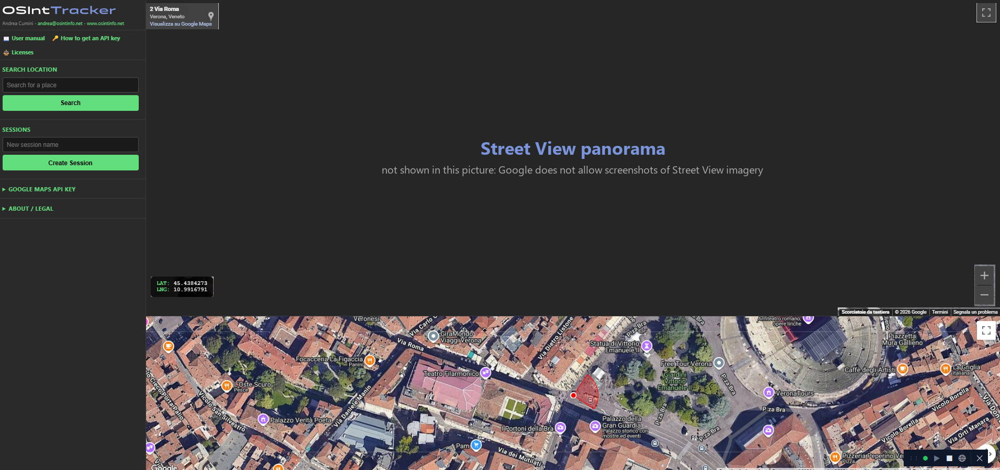

<picture>
  <source media="(prefers-color-scheme: dark)" srcset="logo.svg">
  
</picture>

# OSInt Tracker

Record, annotate and replay a route explored in Google Street View.

- Street View and a hybrid 2D map side by side, kept in sync
- Every step stores the panorama and the camera (heading / pitch / zoom);
  turning the camera on the spot is recorded as its own step
- Tags on any step, shown on the map and during playback
- Playback with keyboard, auto-play and animated camera turns
- Sessions stored locally in SQLite



*In this picture the Street View area is replaced by a placeholder: Google does
not allow screenshots of Street View imagery to be published. In the program
that area shows the real panorama.*

## Quick start

Requires Python 3.10+ and your own Google Maps API key (Maps JavaScript API
enabled).

```
pip install -r requirements.txt
pythonw launcher.py
```

A small always-on-top bar appears bottom-right: it starts the server and opens
the web panel on http://127.0.0.1:5000. Paste your API key in the panel on the
first run. The user manual (English / Italian), including how to get an API
key, is in the panel under "📖 User manual" ([manual.html](manual.html)); see
also [SETUP.txt](SETUP.txt).

Your API key (`key.txt`) and your recordings (`osint.db`) stay on your
computer, next to the program. The server only listens on this computer and
only answers the program's own page.

To build the Windows executable: `pip install pyinstaller`, then
`python build.py`.

## Google Maps

This application includes Google Maps features and content. Use of Google Maps
features and content is subject to the then-current versions of the
[Google Maps/Google Earth Additional Terms of Service](https://maps.google.com/help/terms_maps/)
and the [Google Privacy Policy](https://policies.google.com/privacy).

You use your own API key and are responsible for complying with the
[Google Maps Platform Terms of Service](https://cloud.google.com/maps-platform/terms).
The program stores Google panorama IDs, camera angles and your notes only: no
coordinates, Street View imagery or map tiles. Positions are requested from
Google each time a session is opened.

This project is not affiliated with, endorsed by, or sponsored by Google.
Google Maps and Street View are trademarks of Google LLC.

## License

Copyright (C) 2024-2026 Andrea Cumini - andrea@osintinfo.net - www.osintinfo.net

Free software under the **GNU General Public License version 3** with
additional terms under section 7 (preservation of the author attribution):
see [LICENSE](LICENSE) and [NOTICE](NOTICE). It comes with no warranty: the
terms of use and disclaimer in [DISCLAIMER.txt](DISCLAIMER.txt) are shown each
time the program starts and must be accepted to use it.
